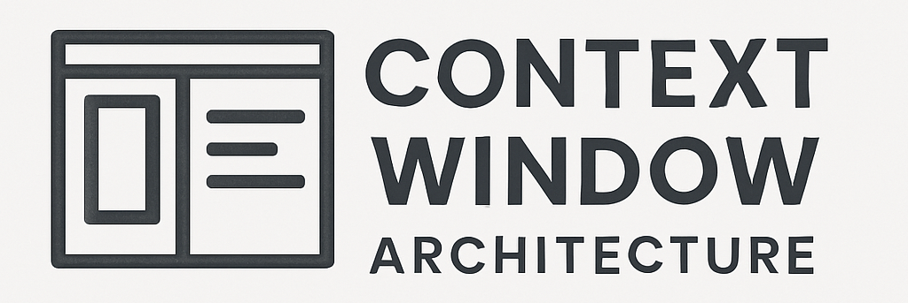

# Context Window Architecture

  

  <strong>provides the "why" and "what" that should inform the "how" of context engineering</strong>

  <a href="https://github.com/context-window-architecture/toolkit">Toolkit</a> |
  <a href="...">Specification</a> |
  <a href="https://github.com/orgs/context-window-architecture/discussions">Discussions</a>

CWA is a reference architecture proposed to elevate the practice of prompt construction from an informal craft to a disciplined engineering practice. By conceptualizing the context window as a stack of distinct, purposeful layers, CWA provides a mental model that brings clarity, predictability, and structure to LLM interaction design. The adoption of this architecture will empower teams to build more predictable, capable, debuggable, and contextually aware AI systems, leading to more effective and trustworthy user experiences.

## Getting Started
