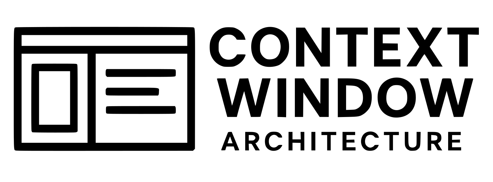
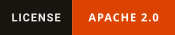
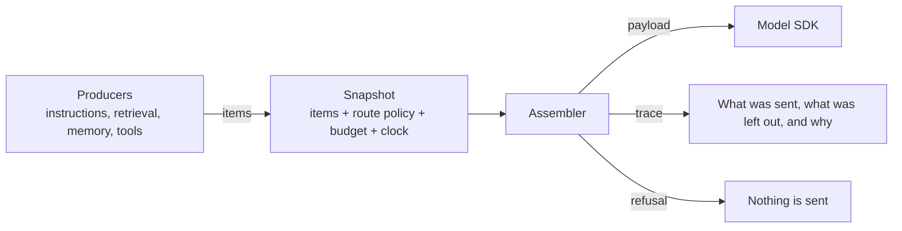
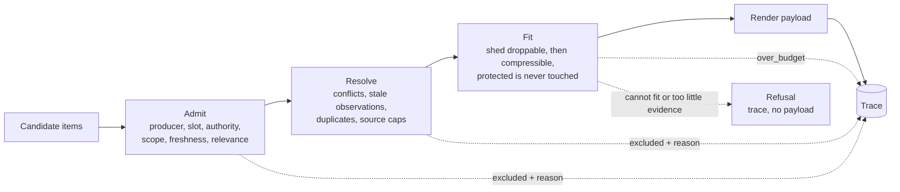

  <picture>
    <source media="(prefers-color-scheme: dark)" srcset="assets/logo-dark.png">
    
  </picture>

  <strong>provides the "why" and "what" that should inform the "how" of context engineering</strong>

  
  
  
  

  
  
  
  

Context Window Architecture (CWA) is a draft specification for assembling every model call from **typed slots**. It treats a model request as compiled output rather than a string you concatenate: producers propose items, the application freezes them into a snapshot, and an assembler turns that snapshot into the request plus a trace of what was sent, what was left out and why. Assembly is deterministic and never calls a model, so what reaches the model can be reviewed, tested and replayed.

```mermaid
flowchart LR
    P["Producers<br/>instructions, retrieval, memory, tools"] -->|items| S["Snapshot<br/>items + route policy + budget + clock"]
    S --> A["Assembler"]
    A -->|payload| M["Model SDK"]
    A -->|trace| T["What was sent, what was left out, and why"]
    A -->|refusal| R["Nothing is sent"]
```

## Vocabulary

| Term | Meaning |
| --- | --- |
| **Item** | One piece of candidate context: an instruction, a retrieved chunk, a conversation turn, a tool result |
| **Slot** | The typed place an item belongs, such as `evidence.knowledge` or `interaction.query`. Each item has exactly one, and the slot fixes its authority and budget tier |
| **Plane** | A group of slots answering one question: *governance* (who may direct the model), *state* (what is true now), *evidence* (what the model may ground on), *interaction* (what happened, and what is asked) |
| **Producer** | Anything that emits items: a retriever, a memory store, an MCP server, the application itself |
| **Route policy** | The versioned rules for one model route: which producers and slots it accepts, its thresholds and its fitting order |
| **Snapshot** | The frozen input to one assembly. The same snapshot always yields the same payload and trace |
| **Assembler** | The component that admits, resolves and fits items, renders the payload and writes the trace |
| **Trace** | The record of every decision, each exclusion with its reason code |

Every candidate item is either admitted or excluded with one reason. If protected content can't fit, or there is too little evidence to answer, the assembler refuses before any model is called.

```mermaid
flowchart LR
    I["Candidate items"] --> A["Admit<br/>producer, slot, authority,<br/>scope, freshness, relevance"]
    A --> R["Resolve<br/>conflicts, stale observations,<br/>duplicates, source caps"]
    R --> F["Fit<br/>shed droppable, then compressible,<br/>protected is never touched"]
    F --> P["Render payload"]
    A -.->|excluded + reason| T[("Trace")]
    R -.->|excluded + reason| T
    F -.->|over_budget| T
    F -.->|cannot fit or too little evidence| X["Refusal<br/>trace, no payload"]
    P --> T
```

## Repositories

| Repository | What it holds |
| --- | --- |
| [contextwindowarchitecture](https://github.com/contextwindowarchitecture/contextwindowarchitecture) | The specification on its own: the text, JSON Schemas, contract data and conformance cases. Issues, pull requests and discussions about the spec go here |
| [website](https://github.com/contextwindowarchitecture/website) | [contextwindowarchitecture.io](https://contextwindowarchitecture.io): the spec with guides, evidence and browser tools |
| [assembler-python](https://github.com/contextwindowarchitecture/assembler-python) | The reference assembler |
| [assembler-typescript](https://github.com/contextwindowarchitecture/assembler-typescript), [assembler-go](https://github.com/contextwindowarchitecture/assembler-go), [assembler-rust](https://github.com/contextwindowarchitecture/assembler-rust) | Assemblers in other languages, passing the same conformance cases |
| [assembler-template](https://github.com/contextwindowarchitecture/assembler-template) | A starting point for an assembler in a new language |
| [examples](https://github.com/contextwindowarchitecture/examples) | Runnable Python apps, from a help-center bot to a production-shaped agent, each shown before and after CWA |
| [assembler-demo](https://github.com/contextwindowarchitecture/assembler-demo) | An inspector that runs the same snapshots through all four assemblers and shows every decision |

Every conformant assembler publishes a conformance report; the [Assembler page](https://contextwindowarchitecture.io/assembler.html) shows them side by side. All repositories release under one shared tag name, and while the spec is a draft the `draft-release` tag moves to each new export.

## Getting started

- **Learn the model:** start at [contextwindowarchitecture.io](https://contextwindowarchitecture.io), then read the [specification](https://contextwindowarchitecture.io/spec.html).
- **See it work:** run [01-docs-qa](https://github.com/contextwindowarchitecture/examples/tree/main/01-docs-qa). No API key is needed to see what would be sent.
- **Adopt it:** follow [Getting started](https://contextwindowarchitecture.io/start.html) to go from an existing prompt to a first assembled payload.
- **Write a producer:** read the [producer guide](https://contextwindowarchitecture.io/producers.html).
- **Port an assembler:** begin from [assembler-template](https://github.com/contextwindowarchitecture/assembler-template) and run the conformance cases.
- **Ask or propose:** start a [discussion](https://github.com/contextwindowarchitecture/contextwindowarchitecture/discussions), open an [issue](https://github.com/contextwindowarchitecture/contextwindowarchitecture/issues) or send a [pull request](https://github.com/contextwindowarchitecture/contextwindowarchitecture/pulls) in the spec repository.
